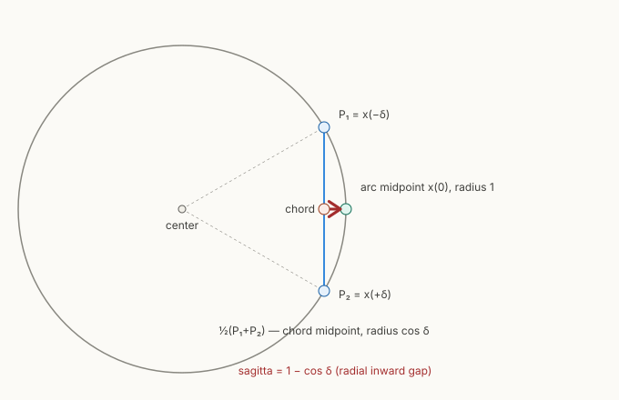

# The shortcut v-averaging bias — a manifold-geometry mistake

> **⚠ STATUS 2026-08-07 — HYPOTHESIS STATUS FOR THE D3 RESULT.** The
> derivation below, and its synthetic verification at zero model error
> (5.1 / 16.1 / 24.1 % versus 0.000000), are **proven**. Its use as the
> *explanation* for why the shortcut objective is not learnable on our
> diffusion cell is a **hypothesis**, not a confirmed result: that arm ran
> `endpoint_inversion`, the exact construction, so the theory predicts it
> should have worked and it did not, and the cross-base comparison also
> varies depth. Write the derivation as proven and the attribution as a
> hypothesis with its decider named. **Decider:** the A4 2×2 (`v_average`
> vs `endpoint_inversion`, one base, one depth, config-only).
>
> **Do not extend this argument to the D2 diffusion-versus-flow
> action-specificity result.** That is a claim about conditional entropy,
> not about the target construction; see
> [[../writing/thesis-storyline]] §"Why diffusion appears better suited".

> **Claim (analysed result, numerically verified).** The self-consistency
> target `((v1 + v2) / 2).detach()` in `compute_self_consistency_target_v`
> is **biased for diffusion v-prediction**. It is exact for flow matching,
> where it comes from (Frans et al. 2024, eq. 4), but the model here is
> `prediction_type: velocity` stepped by `ddim_micro_step_v` — a different
> geometry. The bias is zero as the step size → 0 and grows fast toward
> few-/one-step generation, which is exactly the D3 regime. It is **not**
> removed by more training: the true velocity field is not a fixed point of
> the averaging rule. Interactive companion: `[[../writing/shortcut-v-averaging-bias.html]]`.

## 1. The setup in one picture

Both diffusion and flow matching integrate a vector field from noise to
data. The shortcut model conditions on a step size `d` and is trained so
that one `2d` step equals two `d` steps (self-consistency, eq. 4):

```
s(x_t, t, 2d) ≈ ½·s(x_t, t, d) + ½·s(x_{t+d}, t+d, d)
```

In code (`shortcut_targets.py:34-58`): `v1 = model(x_t,t,d)`, step to
`x_mid` via one DDIM micro-step, `v2 = model(x_mid,t−d,d)`, return
`((v1+v2)/2).detach()`. The student is queried at step `2d` and regressed
onto that average.

## 2. Why it is exact for flow matching and not for v-prediction

- **Flow matching = flat space.** Linear interpolant `x_t=(1−t)x₀+t·x₁`;
  velocity `v=x₁−x₀` is *constant* along the path; a step is `x+d·v`
  (linear). The trajectory is a **straight line**, so `v1` and `v2` are the
  *same vector*; averaging changes nothing. Exact.
- **Diffusion v-prediction = curved space.** With the noise-angle
  `φ = arccos√ᾱ_t` (= `arctan(σ_t/α_t)`), the trajectory is
  `x_φ = cosφ·x₀ + sinφ·ε` — a **circular arc** — and `v` is its **tangent**
  (`v = dx/dφ`). The DDIM step is a **rotation**:
  `x_{φ+Δ} = cosΔ·x_φ + sinΔ·v` (derived in [[ddim-step-v-parameterisation]]).
  The tangent **rotates** as you move along the arc, so `v1` and `v2` point
  in different directions. Averaging them is wrong.


*Left: flow matching — a straight path, every velocity arrow identical, so
averaging changes nothing. Right: VP diffusion — a curved arc, the velocity
rotates along it. The code averages the right-hand arrows as if they were the
left-hand ones.*

## 3. The real reason — adding tangents across tangent spaces

This is the geometric core (the framing to carry into the thesis):

- `v1 ∈ T_{p₀}M` and `v2 ∈ T_{p₁}M` live in **different tangent spaces**.
  A manifold has **no intrinsic `+`** between vectors at different points.
- The ambient `ℝ^d` addition `v1+v2` *is* defined — but only because the
  ambient space supplies an extra structure the manifold lacks: the
  **trivial identification of all tangent spaces** (the flat connection).
  Using it silently pretends the local frame did not rotate between `p₀`
  and `p₁`.
- The discrepancy between ambient-added tangents and the geometry-respecting
  (parallel-transported) combination is exactly the **frame rotation
  (holonomy)** accumulated along the arc. It **grows with arc-distance**, so
  the error is small for fine steps and large for coarse/one-step.

**Two distinct errors** (keeping them separate is what reveals why two
different fixes exist):

| error | what it is | when |
|---|---|---|
| **addition / holonomy error** | the averaged *vector* is wrong (mostly a **rotation** of ≈ δ/2, plus a small cos(δ/2) shrink) because the frame rotated between the two points | whenever you add tangents from different points |
| **off-manifold drift** | following *any* tangent as a straight ambient (Euler) step leaves a curved path (chord ≠ arc) | whenever you step with a velocity on a curved manifold |

**The honest ambient operation is point-differencing, not tangent-adding.**
Differencing two points gives a secant/chord, and chords compose exactly:
`AB⃗ + BC⃗ = AC⃗`. Adding two tangents from different points does not. Both
are "ambient operations," but only one respects the geometry. The shortcut
paper's choice to parametrise in *velocity* is what put the implementation
on the wrong side of that line.

## 3.1 The same bias at the level of points — the sagitta

The bias is already there *before* any talk of velocities. Take two points
on the unit circle, symmetric about angle 0, separated by total angle `2δ`
(coordinates in the `(x₀,ε)` basis):

```
P₁ = x(−δ) = (cosδ, −sinδ),   P₂ = x(+δ) = (cosδ, +sinδ)
```

- **Arc midpoint** (what the manifold calls the midpoint, on the circle):
  `M_arc = x(0) = (1, 0)`.
- **Ambient average** (what you compute when you sum and halve):
  `M_avg = ½(P₁+P₂) = (cosδ, 0)`.

Same direction (the `x₀`-axis), different radius: `M_arc` sits at radius 1
(on the circle); `M_avg` sits at radius `cosδ < 1` — pulled inward toward the
chord, **off the manifold**. The gap is purely radial:

```
M_arc − M_avg = (1 − cosδ, 0),   magnitude 1 − cosδ ≈ δ²/2.
```

`1 − cosδ` is the **sagitta** of the arc (Latin "arrow": the chord is the
bow). The averaging-of-points error *is* the sagitta. The operation never
fails — both points and their average are well-defined — it just lands at the
wrong radius.

**Why this is the same as the velocity bias.** Averaging two unit tangents
`2δ` apart also yields magnitude `cosδ` (the projection-onto-the-bisector
factor is the same for points and for tangents — both are vectors in the
plane being chord-interpolated). Point-average and velocity-average are the
**same `cosδ` foreshortening**, related by a derivative.

**The deepest statement — wrong kind of mean.** The arithmetic mean
`½(P₁+P₂)` is the **Euclidean centroid** (minimises summed *straight-line*
squared distance). The manifold's midpoint is the **Riemannian centroid /
Fréchet (Karcher) mean** (minimises summed *arc-length* squared distance). On
flat space they coincide; on the circle the Euclidean centroid lands inside
at radius `cosδ`, the Riemannian one is the arc midpoint. Their discrepancy
is the sagitta — **curvature × step²** to leading order (here κ=1). Flow
matching's straight path has κ=0, so the two means coincide and averaging is
exact; the VP circle has κ=1, so they differ.

This is also why **differencing points is fine but averaging is not**:
differencing gives the chord — an honest ambient secant that never pretends
to lie on the manifold — whereas averaging computes a Euclidean centroid and
then *implicitly treats it as a manifold point*, which is where the
off-manifold sagitta sneaks in.

**The fix is to use the geometry-aware mean — and that is *not* φ-reparam.**
The Riemannian centroid requires **mapping back onto the manifold** (it is a
*point on the circle*, not the inward-pulled centroid). For the shortcut
target, that map-back is exactly the **endpoint composition** — follow the
flow to the real landing and re-derive (Options A/B in §5). Merely making the
step grid uniform in arc-length `φ` (Option C, [[noise-angle-phi-and-schedule]])
flattens the *ladder* but supplies **no map-back**, so it does not convert the
Euclidean mean into the Riemannian one — consistent with §4, where φ-uniform
velocity-averaging is still biased.



*The chord midpoint `½(P₁+P₂)` sits at radius `cosδ`, inside the arc midpoint
(radius 1) on the circle; the radial gap is the sagitta `1−cosδ ≈ δ²/2`.*
Interactive version: `[[../writing/shortcut-v-averaging-bias.html]]` §◆.

## 4. The fixed-point criterion (the rigorous test)

A self-consistency target rule is **unbiased iff the true field is a fixed
point of its composition.** If it is not, the bootstrap converges to a
*different*, biased field — no amount of training or anchoring fixes it
(the d→0 flow-matching anchor pins the base to truth, so the bias instead
accumulates *up* the doubling tower).

Numerically (pure uniform-angle, consistent ray, `φ₀=50°`):

| half-step δ | velocity-averaging residual | displacement-addition residual |
|---|---|---|
| 5° | 0.0436 | 0 |
| 10° | 0.0872 | 0 |
| 20° | 0.1736 | 0 |
| 30° | 0.2588 | 0 |
| 45° | 0.3827 | 0 |

- **Velocity-averaging:** residual ≈ 2·sin(δ/2) ≠ 0. The average
  `½(v_φ + v_{φ+δ}) = cos(δ/2)·v_{φ+δ/2}` is rotated δ/2 off the correct
  `v_φ`. The true field is **not** a fixed point → biased.
- **Displacement-addition:** residual exactly 0 at every step → the true
  secant field **is** a fixed point → exact.

Landing-error confirmation on the real `ddim_micro_step_v` (DynamiCrafter
linear-β, single exact ray, **zero model error**): a single `2d` step using
the averaged target lands **5.1 % off at s=1/4, 16.1 % at s=1/2 (2-step),
24.1 % at s=3/4**; the endpoint/displacement target lands **0.000000** at
every step.

## 4.1 "But aren't we off-manifold anyway?" — self-consistent map ≠ correct generation

A natural objection: the averaged target is off-manifold, but *everything* is
approximate — doesn't averaging just define *some* self-consistent map, which
is fine? Two things resolve this, and they sharpen (not weaken) the bug.

**Yes, averaging defines a self-consistent map in isolation.** A converged
network *can* drive the loss to zero — `g(x,t,2d) = avg(g(x,t,d))` exactly —
a perfectly coherent map. So "off-manifold" alone is not the indictment.

**But self-consistent ≠ correct for generation.** The goal is few-step
sampling matching many-step. That requires `g(2d)` to be the velocity that
**reproduces** the two-`d`-step endpoint. Averaging produces the
**shrunk + rotated chord** thing, not the reproducing velocity. So a
zero-loss model *still* generates biased few-step samples. This is the
fixed-point statement of §4 read operationally: the loss is satisfied by the
wrong field.

**Why flow matching is exempt — `avg = reproducing`, exactly.** In flow
matching the step is linear, so the average of two half-step velocities *is*
the velocity that reproduces the full step. Self-consistent ⟺ correct. In
VP/DDIM the `cos(θ/2)` shrink + rotation makes `avg ≠ reproducing`, so the two
notions split — and only coincide as `d → 0`.

**The anchor's role — and what is/ isn't damaged.** The `d→0` flow-matching
loss pins the small-`d` field to the true denoiser on real data; that anchor
is what prevents the trivial `g≡0` fixed point and what preserves
DynamiCrafter's many-step quality. Because the self-consistency target is
**detached** (`.detach()` in `compute_self_consistency_target_v`), its
gradient does **not** flow into the small-`d` field — so the base / many-step
field is preserved, and **the bias lives in the large-`d` (few-step) tower**
built above the anchor. (A softer, capacity-driven drift of the shared
network *could* perturb the base, but that is empirical, not the clean
mechanism; the clean, unavoidable damage is biased few-step generation.)

**Does uniformising the factor (φ-reparam) rescue it? No.** Making the shrink
factor uniform per level (Option C, [[noise-angle-phi-and-schedule]]) yields a
*cleaner* self-consistent map, but `avg` is still not the reproducing velocity
— so few-step sampling stays biased (the 3–38% in §4 is *pure uniform-angle*).
φ-reparam removes the **secondary** non-uniformity; it does not make
`avg = reproducing`. Only **endpoint inversion / displacement** (Options A/B)
does that — which is why those, not the reparametrisation, are the fix that
matters. (This corrects an appealing but wrong line of reasoning that
concludes φ-reparam alone suffices.)

## 5. The candidate fixes

| # | fix | exact? | why / evidence |
|---|---|---|---|
| — | **Endpoint inversion** (recommended start) | **yes** | Follow the ODE *both* sub-steps to the real landing `x_end`, then invert the DDIM recompose for the single-`2d` velocity that hits it. Target-only change; keeps the velocity head + DDIM sampler; schedule-faithful. True field is a fixed point. |
| 2 | **Predict displacement, compose additively** | **yes** | `Δ(2d)=Δ(d)+Δ′(d)` — point-differencing telescopes exactly, schedule-independent. The same fix in displacement coordinates. Cost: reparametrise the head output **and** the shortcut sampler (add displacements, not DDIM-recompose); base case grounds on `≈ d·v_true`. Best if DynamiCrafter's β-schedule is not a clean uniform-angle circle. |
| 1 | **Reparametrise to arc-length φ** | **no (for this bias)** | Fixes the *secondary* misalignment (timesteps ≠ angle, `φ(t)` nonlinear — see [[noise-angle-phi-and-schedule]]) — worth doing as a stacked complement. But it does **not** change the composition rule, so velocity-averaging's fixed point stays biased: pure uniform-angle still lands 3–38 % off (table above). The "uniform holonomy → absorbable scalar" intuition fails because (a) the discrepancy is a **rotation**, not a scalar, and (b) the true field is not a fixed point, so it is not absorbed — it compounds up the tower. |
| 3 | **Closed-form scalar correction** `sin(δ/2)/(δ/2)·½(v1+v2)` | **no** | A scalar can only fix magnitude; the dominant error is the δ/2 **rotation**. Numerically its landing error is *identical to the uncorrected average* to the decimal (3.0 %, 11.2 %, 22.4 %, 38.3 %). Effectively a no-op. Reject (not even a useful ablation). |

**Recommendation.** Implement **endpoint inversion** (least invasive, exact,
schedule-faithful) or, if the schedule is suspect, **displacement
prediction** — they are the same endpoint-consistency idea in two
coordinate choices. Stack **arc-length reparam** on top for the secondary
issue. Drop the scalar correction.

Decision: [[../../50_Decisions/open/shortcut-target-endpoint-vs-v-averaging]].

## 6. Consequence and the "paper-faithful" wording

The docstring and [[shortcut-training]] call the target "paper-faithful
(Frans et al. 2024, eq. 4)." That is faithful only in the `d→0` limit /
flow-matching world. Under v-prediction, *faithful* means
**endpoint-consistent**, not **v-averaged**. The wording in the docstring
and [[shortcut-training]] §3 should be corrected once the fix lands.

This is plausibly a material cap on the D3 few-step result, independent of
training length — the per-rung shortcut loss (logged per step size after the
trainer change of 2026-06-17) should show the coarse rungs converging once
the target is endpoint-consistent, where today they plateau.

## Related

- [[ddim-step-v-parameterisation]] — the DDIM v-step primitive this inverts.
- [[shortcut-training]] — the general idea + our adapter framing (wording to fix).
- [[../related-work/shortcut-models]] — Frans et al. 2024, the flow-matching source of eq. (4).
- [[../../50_Decisions/open/shortcut-target-endpoint-vs-v-averaging]] — which fix to ship.
- `[[../writing/shortcut-v-averaging-bias.html]]` — interactive visual explainer.
