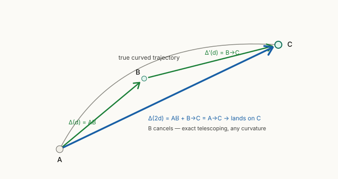

# Decision: how to fix the biased shortcut self-consistency target

## Status

**Decided (2026-06-22).** The bias is established (see
[[../../30_Knowledge/theory/shortcut-v-averaging-bias]] — verified
numerically on the real `ddim_micro_step_v`). The remaining question — *which
fix to ship* — is resolved below.

## Decision (2026-06-22)

Implement **both A (endpoint inversion) and B (displacement)** as
endpoint-consistent shortcut targets, **selectable at runtime via config**,
alongside the existing biased `v_average` rule, which is **kept as an ablation
baseline** (not deleted). The Wan2.1 flow-matching backbone (**Option E**,
κ=0 → bias gone by construction) proceeds on its **own track regardless** — it
is orthogonal, not a substitute for the diffusion-side fix. **C** (arc-length
φ reparam) is **deferred** as an optional secondary stack-on. **D** (scalar
correction) is **rejected**.

Rationale:

- A and B are the *same* endpoint-consistency idea in two coordinate choices,
  both exact. Shipping both turns the fix into a clean **ablation axis**
  (biased average vs. inversion vs. displacement) and a richer D3 methods
  paragraph — the explicit goal (some geometry/theory in the thesis).
- **A is target-only** → lands first, cheap, and is the falsifiable test of the
  diagnosis: per-rung coarse rungs should converge where they plateau today
  (per-rung logging shipped 2026-06-17).
- **B reparametrises the head + sampler** (more invasive) but is
  schedule-independent and conceptually cleanest; it cross-checks A.
- Backbone (E) and target fix (A/B) **compose** — E removes the need for a fix
  *on flow*, but A/B keep the diffusion side of the D1 diffusion↔flow span
  evidenced and let the bias stand as a named contribution rather than a
  sidestepped footnote.

## Consequences

- A **config selector** for the shortcut target method
  (`endpoint_inversion` | `displacement` | `v_average` baseline). Confirm how
  it relates to the existing `shortcut_target_method` field (which currently
  selects teacher paths) before extending it vs. adding a sibling selector — do
  not assume the current values.
- **A:** add `invert_ddim_v` mirroring `ddim_micro_step_v` **including
  `scale_arr`/dynamic-rescale**; confirm whether the DynamiCrafter configs use
  dynamic rescale before implementing. Target =
  `v = (x_end − cos(Δ)·x_t)/sin(Δ)`, *not* the chord `x_end − x_t`.
- **B:** head outputs displacement `Δ`; few-step sampler composes additively
  (`Δ(2d)=Δ(d)+Δ′(d)`); `d→0` grounded on `≈ d·v_true`.
- **Wording:** the "paper-faithful (Frans eq. 4)" claim in the docstring and
  [[../../30_Knowledge/theory/shortcut-training]] §3 must be corrected
  (faithful = endpoint-consistent under v-prediction, not v-averaged).
- **Thesis:** the bias + geometry + fix becomes an explicit D3 theory
  paragraph, sourced from
  [[../../30_Knowledge/theory/shortcut-v-averaging-bias]] and
  [[../../30_Knowledge/theory/ddim-step-v-parameterisation]].

## Context

`compute_self_consistency_target_v` returns `((v1 + v2) / 2).detach()`. That
average is exact for flow matching (Frans et al. 2024, eq. 4) but **biased
for v-prediction + DDIM**: on a perfectly consistent trajectory it lands
5–24 % off the true endpoint for steps from `s=1/4` to `s=3/4`, worst in the
few-/one-step regime D3 targets. The true velocity field is **not a fixed
point** of the averaging rule, so more training cannot remove it.

## Options

### A — Endpoint inversion  *(recommended starting point)*

Take the **second** sub-step too (`x_end = DDIM(x_mid, v2, t−d→t−2d)`), then
invert the DDIM recompose for the single-`2d` velocity that lands on
`x_end`. Closed form for `scale_arr=None`; rescale-aware via the decoded
`(x̂₀,ε̂)` when dynamic rescale is on.

- **Pros:** exact (true field is a fixed point); **target-only change**,
  keeps the velocity head and the DDIM sampler; schedule-faithful (uses the
  real stepper). Least invasive — drop-in.
- **Well-posedness (a common objection):** "you can't invert a big jump,
  DDIM is infinitesimal" is a misconception. A DDIM step is a finite
  **rotation** `cos(2δ)·x + sin(2δ)·v`, not an Euler translation, so inverting
  it for any endpoint and any jump size is unique and trivial:
  `v = (C − cos(2δ)·x)/sin(2δ)`. Derivation + edge cases:
  [[../../30_Knowledge/theory/ddim-step-v-parameterisation]] §8.
- **Cons:** an `invert_ddim_v` that must mirror `ddim_micro_step_v` exactly
  (incl. `scale_arr`). **No extra model forward** — the two forwards
  (`v1`, `v2`) are already paid; the fix only adds one closed-form DDIM
  micro-step (`x_end`) + the inversion, both cheap arithmetic on tensors
  already in hand. The target is the velocity that *reproduces* the endpoint
  under the DDIM step, `v_target = (x_end − cos(2δ)·x_t)/sin(2δ)` — **not**
  the chord `x_end − x_t` (that is Option B's displacement target, which
  pairs with additive stepping).

### B — Predict displacement, compose additively

Reparametrise the shortcut head to output the net displacement `Δ` and
compose `Δ(2d)=Δ(d)+Δ′(d)`; sample by adding displacements.

*The two sub-chords add tip-to-tail to the full chord, landing exactly on C —
the intermediate point cancels, regardless of curvature or schedule.*

- **Pros:** exact and **schedule-independent** (point-differencing
  telescopes regardless of curvature). Conceptually cleanest — it is the
  "flatten into secant space" move.
- **Cons:** reparametrises the head **and** the shortcut sampler (no longer
  DDIM-recompose for that path); `d→0` grounding slightly less elegant
  (anchor on `≈ d·v_true`). Bigger architectural change. Best if
  DynamiCrafter's β-schedule is not a clean uniform-angle circle.

### C — Arc-length (φ) reparametrisation  *(stack as a secondary fix, not the cure)*

Condition on / sample step sizes uniform in the noise-angle `φ` (full
derivation + DynamiCrafter numbers + the φ-uniform grid builder:
[[../../30_Knowledge/theory/noise-angle-phi-and-schedule]]).

- **Fixes the secondary misalignment** (timesteps ≠ angle, `φ(t)`
  nonlinear) — worth doing on top of A or B.
- **Does NOT fix the primary bias:** it leaves the composition rule
  (velocity-averaging) unchanged, so the biased fixed point persists. Pure
  uniform-angle still lands 3–38 % off. The "uniform holonomy → absorbable
  scalar" argument fails: the discrepancy is a **rotation**, not a scalar,
  and the true field is not a fixed point.

### D — Closed-form scalar correction  *(rejected)*

`s_target = sin(δ/2)/(δ/2) · ½(v1+v2)`.

- **Rejected with evidence:** a scalar corrects only magnitude, but the
  dominant error is the δ/2 rotation. Its landing error is identical to the
  uncorrected average to the decimal (3.0/11.2/22.4/38.3 %). A no-op.

### E — Use a flow-matching base  *(the structural escape — orthogonal)*

Don't be on the VP circle at all. The bias *is* curvature; a flow-matching
base has `κ=0`, so `avg = reproducing`, the sagitta is identically zero, and
Frans eq. (4) is exact **as written** — no target surgery, inversion, or
reparametrisation.

- **Pros:** removes the bug entirely and by construction; no shortcut-target
  code needed; conceptually cleanest. eq. (4) is faithful, not "faithful only
  as d→0."
- **Cons:** a **backbone-level** decision, not a loss tweak. DynamiCrafter is
  v-pred diffusion, so this means adopting a flow-matching video backbone (or
  reparametrising the base), with its own pretraining / quality trade-offs.
  Orthogonal to A/B/C/D (which all keep the diffusion base).
- **Note:** the framework spans both diffusion and flow matching (D1), so this
  is a legitimate strategic option — weigh it against fixing the target on the
  existing DynamiCrafter base.

## Recommendation (superseded by the Decision above)

> **Superseded 2026-06-22:** both A and B ship, config-selectable, with
> `v_average` kept as the baseline arm; E proceeds independently; C deferred.
> Original recommendation retained below for history.

Ship **A (endpoint inversion)** first — minimal, exact, schedule-faithful —
and **stack C** for the secondary issue. Keep **B** as the fallback if the
β-schedule proves to warp the geometry enough that A's fixed-step assumptions
wobble. Reject **D**. **E (flow-matching base)** is the orthogonal strategic
escape: if a suitable flow-matching video backbone is on the table, it removes
the issue with no target surgery at all — worth weighing at the backbone level
independently of A–D.

## Derived tickets (opened 2026-06-22)

- [[../../20_Tickets/bug-losses-shortcut-v-averaging-target]] — Option A:
  endpoint inversion in `compute_self_consistency_target_v` + `invert_ddim_v`
  + the config selector + a regression test (one `2d` step reproduces the
  two-step landing to <1e-5 on a synthetic ray; assert the old average fails
  the same check at the 2-step rung). Keeps `v_average` as a baseline arm.
- [[../../20_Tickets/feat-shortcut-displacement-target-parametrisation]] —
  Option B: displacement head + additive few-step sampler, config-selectable,
  `d→0` grounding.
- [[../../20_Tickets/chore-writing-fix-paper-faithful-wording]] — correct the
  "paper-faithful" wording in the docstring and
  [[../../30_Knowledge/theory/shortcut-training]] §3.
- [[../../20_Tickets/writeup-writing-shortcut-target-bias-theory-paragraph]] —
  the D3 thesis paragraph on the v-averaging bias + the two endpoint-consistent
  fixes, with the geometry.

## How we will know it worked

The per-rung shortcut loss (logged per step size since the trainer change of
2026-06-17) should show the **coarse rungs converging** after the fix, where
today they plateau — and a measurable few-step rollout-quality gain at
`s ∈ {1/2, 1/4}` versus the current target.
