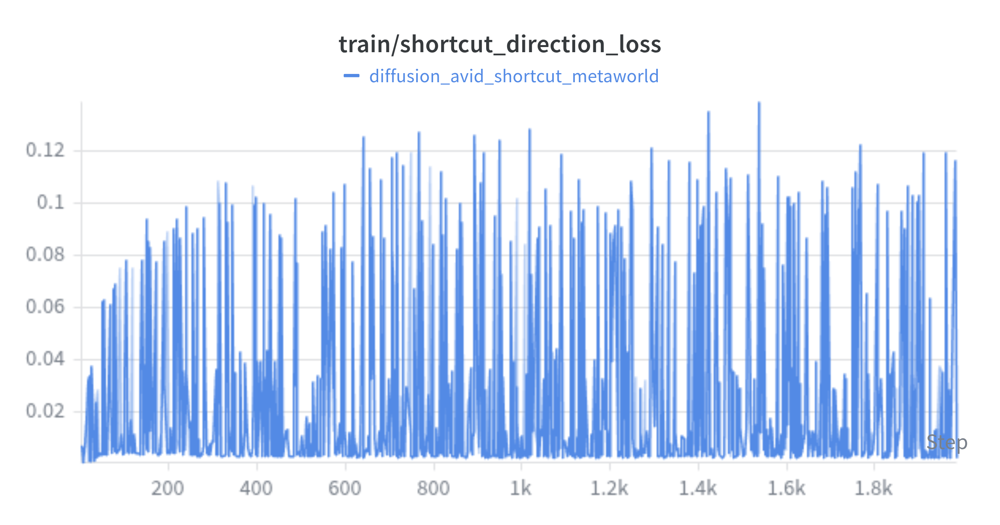
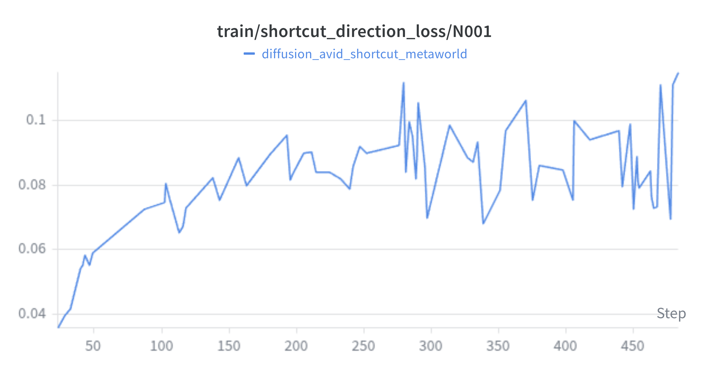
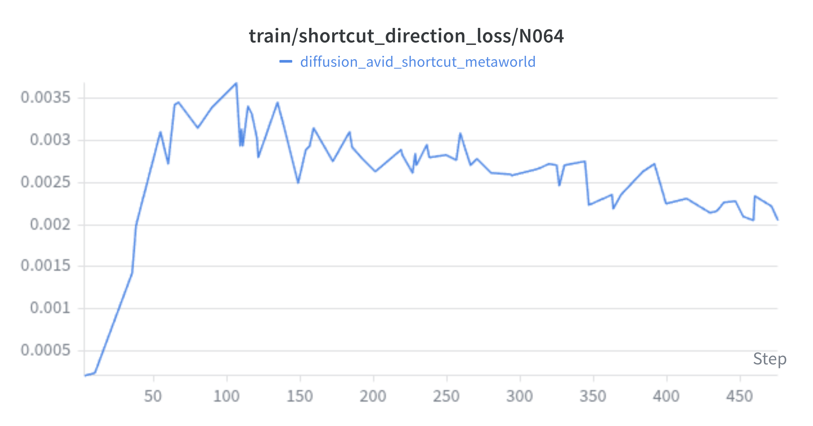
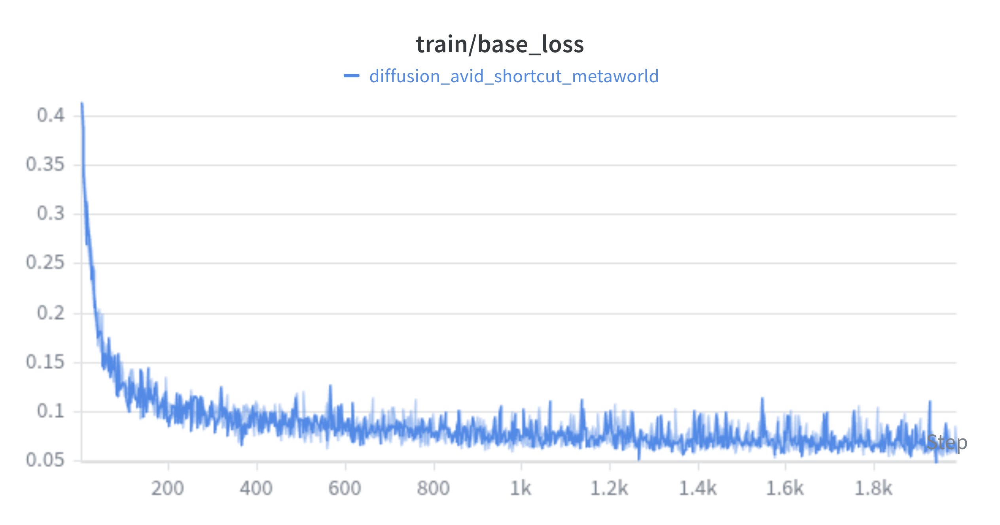
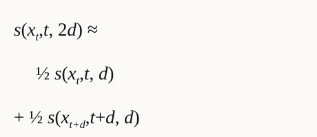
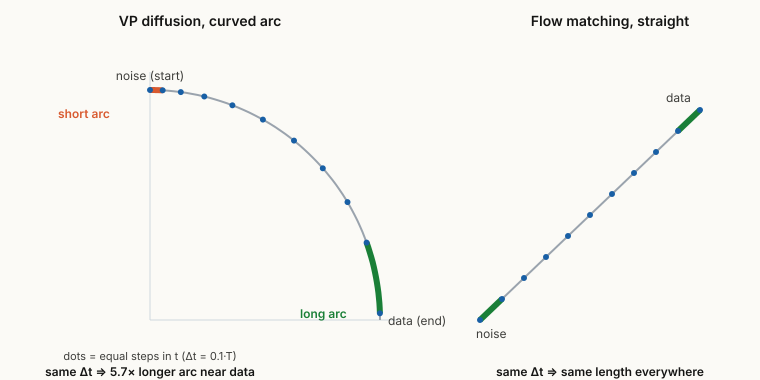
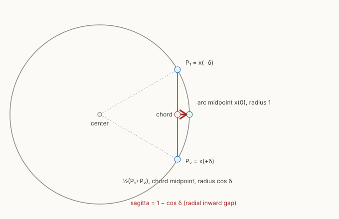
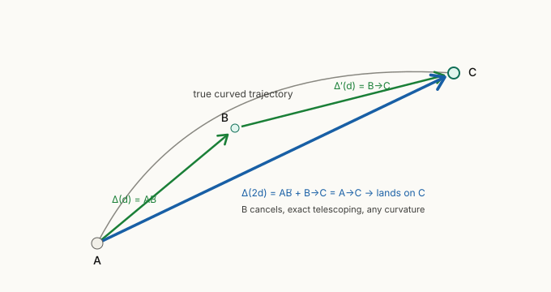

# Agenda

- First end to end **shortcut run on DynamiCrafter**, and a loss curve that looked alarming
- Why the spikes were a **logging artifact** (mixed step sizes), not instability
- Why the few step rollouts are **soft**: a geometric bias we pinned down
- **Fix ideas**, plus a pivot to flow matching bases
- Side finding: an "OOM" that wasn't

<!-- notes: Three threads. A loss diagnosis, a real bug in the shortcut target, and a resulting change of direction. -->

---

### Progress

# First end to end D3 run on DynamiCrafter

- Ran `diffusion_avid_shortcut_metaworld` on **Snellius**. H100, batch 48, about 1600 steps, about 4 h.
- Frozen **DynamiCrafter** (v prediction) plus **AVID** action adapter, trained with shortcut self consistency.
- Added **per rung shortcut loss logging** to the trainer, one curve per sampled step size.
- Turned off classifier free condition dropout (we constrain on actions, we do not guide on them).

<!-- notes: wandb id still to be filed; this is the first row toward product state. -->

---

### Diagnosis · 1 of 2

# The shortcut loss looked alarming

- Jumps up and down **and trends upward** over training, which reads like divergence at a glance.

---

### Diagnosis · 2 of 2

# It is mixing step sizes, not instability

- The aggregate curve **marginalises over the sampled step size `d`**. Split it per rung and the structure appears.
- Per rung magnitudes span about **50×** (`N064 ≈ 0.002` up to `N001 ≈ 0.1`), so one mixed curve swings wildly by which `d` was drawn.
- **Fine rungs converge low; coarse (few step) rungs stay high and never settle**, the pattern the bias predicts (next section).
- Fix shipped: **log one curve per rung**. Could also **normalise the loss by step size**.

::: columns

|||

:::

---

### Sanity check

# The diffusion loss itself is healthy

- The base denoising objective (the general diffusion loss) trains cleanly and plateaus. The frozen base plus adapter optimises fine.
- So the trouble is **not** optimisation. It is specifically the **few step shortcut targets** (the coarse rungs above), for the geometric reason next.

---

### Results

# Few step rollouts: the adapter works, but it is soft

::: columns

|||

|||

:::

- Each panel is **ground truth | frozen base | adapted**. The base alone is fog; the adapter recovers a recognizable arm plus table, so it **is** contributing.
- But frames are **blurry and colour smeared**, and few step quality lags. Not just undertraining; there is a systematic reason. ↓

---

### Why it is soft · 1 of 2

# The shortcut target conditions on a step size d, and d is ambiguous

::: columns
- **Self consistency**: one step of size `2d` should equal two steps of size `d`. The target is **conditioned on the step size `d`**.
- The path is a **circular arc**, so a fixed `d` in **timestep units** sweeps a **different arc length** by position: about **5.7× longer near data than near noise**.
- So `d` is **geometrically ambiguous**: one value means many different jumps, which warps the very doubling the objective rests on.
- In **flow matching** the path is **straight**, so equal `t` steps are equal length everywhere. None of this happens.
|||

:::

---

### Why it is soft · 2 of 2

# Averaging velocities on a circle undershoots

::: columns

|||
- The shortcut target **averages two velocities**. On an arc, averaging two tangents gives a vector that is **shrunk by `cos(θ/2)` and rotated**, so it pulls *inside* the circle (the **sagitta**).
- This biases the few step target **even with a perfect model**. Computed on the real DDIM step (zero model error), the landing error grows about **0% → 5% → 16% → 24%**, from fine steps to the 2 step and ¾ step jumps.
- Worst exactly where D3 lives. **More training cannot fix it**: the loss's fixed point is the wrong field.
:::

<!-- notes: Frans eq. (4) averages, but that is exact only for flow matching (a straight line). Full derivation plus numerics in the bias note. -->

---

### Direction · the fix

# Four ways out

- **Endpoint inversion** *(start here)*: keep the model, fix only the target so one big step reproduces the true two step landing. Exact, drop in.
- **Predict displacement**: compose chords additively, exact and **schedule independent**.
- **Arc length or log SNR reparam**: removes the conditioning ambiguity, **secondary**, stack it.
- **Flow matching base**: a straight line (`κ=0`), so the bias *does not exist*. The structural escape.

---

### Side finding

# An "OOM" that wasn't

- Raising the batch size crashed training, first read as out of memory.
- It was actually a **grid or index overflow** in the attention path, **not** memory. Fixed.

> Takeaway: a bigger batch is not always an OOM. Check the indexing before throwing more GPU at it.

---

### Next direction

# Pivot to a flow matching base

- The bias analysis says it cleanly: **flow matching has `κ=0`**, so no sagitta and averaging is exact, eq. (4) faithful as written. A flow matching base removes D3's sharpest pitfall for free.
- Evaluating two open flow matching video models:
  - **Pyramid Flow**: flow matching, but its pyramidal and temporally autoregressive design complicates a clean frozen `f_base` plus adapter interface (integration and drift concerns we are assessing).
  - **WAN (Wan2.1)**: flow matching DiT, cleaner single shot base, strong open weights, current front runner.
- Keeps the framework's diffusion ↔ flow matching span (D1) intact.

<!-- notes: confirm Pyramid's specific issues before committing; WAN is the leading candidate. -->
