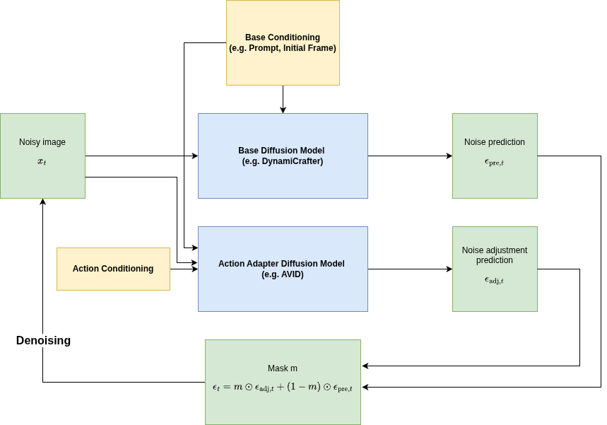
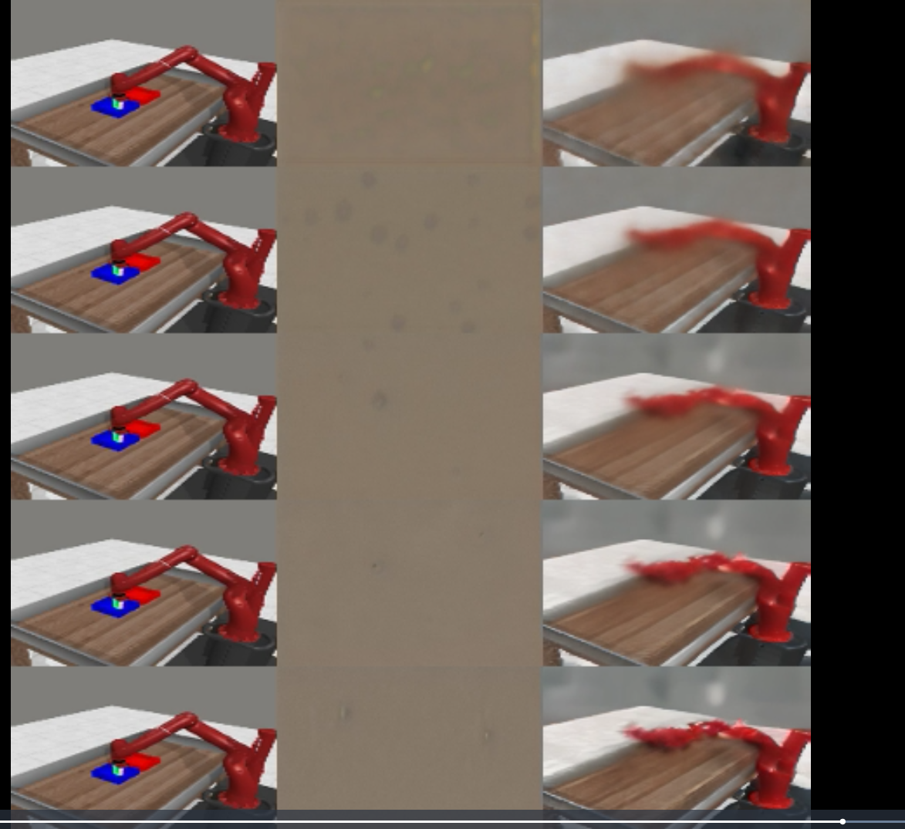
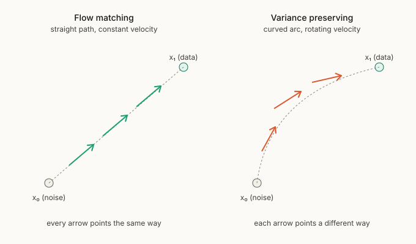
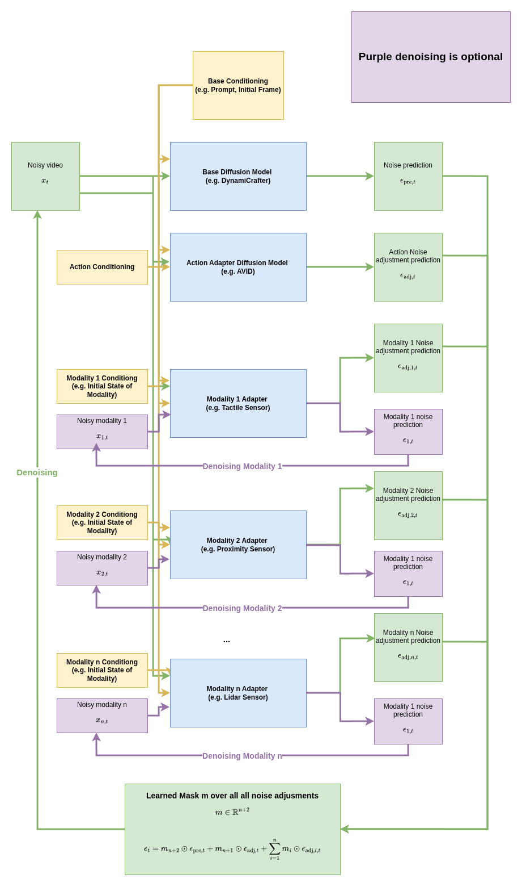

# Agenda

- **The project**, frozen generative priors plus plug and play adapters as action conditioned world models
- **The AVID adapter**, the output adapter we build on, and the diffusion versus flow matching split
- **The problem we found**, the shortcut self consistency target is geometrically biased for diffusion
- **The solution**, endpoint consistent targets, and a pivot to a flow matching base
- **The multimodal adapter**, broadening the same output adapter into coupled multimodal world models

<!-- notes: One arc. What we build, the adapter we build on, a real bug in the few step objective, the fix, and the parallel direction that broadens the contribution. -->

---

# The project

---

### Framing

# Adapter first world models

> Pretrained diffusion and flow matching models are strong generative priors, but cannot be used directly as action conditioned world models. They lack action conditioning and need many denoising steps per rollout.

- The thesis augments any **frozen** pretrained base with a single additive, trainable correction:

```
f(x_t, t, a_t, d) = f_base(x_t, t) + g(d) · Δ_φ(x_t, t, a_t, d)
```

- `f_base` frozen · `Δ_φ` the trainable adapter · `a_t` action conditioning · `d` step size for few step rollout.
- **Not** a new generative algorithm, **not** fine tuning (the base stays frozen), **not** a consistency model retrain. It is an *adaptation layer*.

<!-- notes: The composition rule is the spine of the whole thesis. Everything is a special case of it. -->

---

### Scope

# Four deliverables, one composition rule

::: columns
- **D1, Framework.** One `Adapter` interface across four families (LoRA, hidden state, output, hypernetwork), spanning diffusion *and* flow matching. The **output adapter is the trained workhorse** (next section). *Mostly built.*
- **D2, Action world models.** Learn `f(x_t,t,a_t)`; compare adapter families on accuracy, stability, inference cost. *Pre results.*
|||
- **D3, Shortcut adapters.** Add step size `d`, train with consistency so rollout takes few steps. *First real run landed, the focus of today.*
- **D4, Combined.** Action conditioned shortcut world models for planning. *Gated on D2 plus D3.*
:::

> Optional extension, **multimodal coupled dynamics**: `(x^video_{t+d}, x^prop_{t+d}) = f(x_t, t, a_t, d)`. Now a parallel research line, not a footnote.

---

# The output adapter

---

### The taxonomy and the choice

# Four families exist; we train the output adapter

::: columns
| Family | Attaches | Backward cost |
|---|---|---|
| LoRA | inside attention weights | full base backward |
| Hypernetwork | emits weights into the UNet | full base backward |
| Hidden state | taps internal activations | cheap if detached, but backbone specific |
| **Output (ours)** | **on the base output only** | **adapter only, cheap** |
|||
- All four are implemented (the D1 framework); the other three serve as the **taxonomy and ablation baselines**.
- The composition rule **picks the workhorse for us**: the additive form wants `f_base` to be a fixed, detached input that a small module corrects.
- LoRA and the hypernetwork **re parameterise the base and re run it**, so the gradient flows through the *entire* frozen UNet, a small parameter count but a full network backward pass.
- The output adapter treats the base as a **black box**: backbone agnostic, no internal hooks, cheapest to train, the cleanest plug and play fit.
:::

> Parameter efficiency in *count* does not imply efficiency in *training compute*. The deciding axis is interior versus exterior attachment.

---

### The math

# The composition, formally

- The frozen base is run **once, detached**, so it enters the adapter as a leaf constant:

```
with torch.no_grad():
    base_output = f_base(x_t, t, cond)      # constant input, no autograd edges
Δ = Δ_φ(x_t, t, a_t, d, base_output)        # the only trainable part
```

- The mixing layer owns all interaction with the base. Four composition modes:

```
add              f = base + Δ
gated residual   f = base + σ(g)·Δ          ←  thesis core  f = base + g(d)·Δ
mask mix (AVID)  f = σ(m)·base + (1 − σ(m))·Δ
replace          f = Δ
```

- **Identity at init:** every adapter zero inits its final projection, so `Δ = 0` at step 0 and `f = base`. Training departs from the pretrained prior; it never destroys it.

<!-- notes: Backward only touches Δ_φ. The frozen UNet contributes no edges to autograd, which is the whole appeal of the additive rule. LoRA/HyperAlign forfeit that by reaching inside the base. -->

---

### The building block

# AVID: the gated instance we build on



- **AVID** is the direct precedent and the concrete `mask_mix` instance: `ε_t = σ(m)·ε_pre + (1 − σ(m))·ε_adj`.
- We run a frozen **DynamiCrafter** base plus a trainable **action adapter** (the 11M DynamiCrafter UNet output head).

---

### What we add

# AVID gives the shape; the thesis adds the axes

::: columns
**AVID provides**
- Frozen base plus trainable residual
- Output level, video specific
- A learned mask to mix base versus adapter
|||
**We generalise it**
- **Action conditioning** `a_t` (D2)
- **Step size conditioning** `d` plus consistency training (D3)
- The output family as the contribution's backbone (D1)
- Coverage of **flow matching**, not just diffusion
:::

> The single modality AVID path is effectively done in the repo: the gate (`avid_mask_mix`), the DynamiCrafter output adapter, and structured action conditioning all exist.

---

### The fork in the road

# Diffusion versus flow matching, not interchangeable

::: columns
**Diffusion** (`prediction_type: noise | velocity`)
- The trajectory from noise to data is a **curved arc** (a circle in the `(x₀,ε)` plane).
- A DDIM step is a **rotation**; velocity is the arc's tangent and **rotates** along it.
|||
**Flow matching** (`prediction_type: velocity`)
- Linear interpolant `x_t=(1−t)x₀+t·x₁`, a **straight line**.
- Velocity `v=x₁−x₀` is **constant** along the path.
:::

- The codebase keys off `model_type` and `prediction_type`. They are the source of truth, and the loss target differs per side.
- This distinction looks academic, until you condition on a step size and train for consistency. **That is where it bites.** ↓

---

# The problem we found

---

### D3 in practice

# First end to end shortcut run: the adapter contributes, but rollouts are soft

::: columns

|||
- Frozen DynamiCrafter (v prediction) plus AVID adapter plus shortcut self consistency, on the larger MetaWorld set.
- The base alone is fog; the **adapter recovers a recognisable arm and table**, so it *is* contributing.
- But few step frames are **blurry and colour smeared**, and quality lags. Not just undertraining, there is a systematic reason.
:::

<!-- notes: Run = data/results/20261706, wandb project avid-shortcut-metaworld-0.45; run id still to be filed. Qualitative read only, no metric claimed. -->

---

### Diagnosis

# The alarming loss curve was a logging artifact

- `shortcut_direction_loss` looked **volatile** (swinging roughly 0.01 to 0.12) and divergent, but the **base denoising loss converged cleanly and stably.**
- Splitting the loss **per step size rung** resolved it: magnitude scales monotonically with step size (about **15×** spread), so one mixed curve bounces purely by *which `d` was sampled*. Each rung is individually well behaved.
- **But** a real signature survives: **fine rungs converge, coarse (few step) rungs plateau and never settle.**

::: columns

|||

:::

<!-- notes: Volatility = Case A, step size mixing, answered. The coarse rung plateau is the real bug, next slide. -->

---

### Root cause, 1 of 2

# The self consistency target averages two velocities, on a curved manifold

::: columns

|||
- The target is `((v1 + v2)/2).detach()`, Frans et al. (2024) eq. (4).
- **Exact for flow matching** (a straight line: `v1` and `v2` are the *same vector*, averaging changes nothing).
- **Biased for diffusion v prediction**: on the arc, `v1` and `v2` live in **different tangent spaces** and point in different directions. Averaging them is the wrong operation.
:::



---

### Root cause, 2 of 2

# Averaging on a circle undershoots, the sagitta

::: columns

|||
- Averaging two points (or two unit tangents) `2δ` apart lands **inside** the circle, shrunk by `cos δ`, off the manifold. That radial gap is the **sagitta** (`1−cosδ ≈ δ²/2`).
- It is the wrong *kind* of mean: the arithmetic mean is the **Euclidean centroid**; the manifold wants the **Riemannian (Fréchet) centroid**. They differ by **curvature times step²**.
- **Flow matching has κ=0**, so the two means coincide, so it is exact. The VP circle has κ=1, so they split.
:::

---

### Why it matters

# A real cap on few step quality, independent of training

- On the **real** DDIM v step, with **zero model error**, a single `2d` step using the averaged target lands off by:

::: metrics
landing error at s=1/4 (fine) | ~5% | analytic, zero model error, v averaging bias note §4
landing error at s=1/2 (two step) | ~16% | analytic, zero model error, §4
landing error at s=3/4 | ~24% | analytic, zero model error, §4
displacement or endpoint target | 0.000000 | exact at every step, §4
:::

- **Largest exactly where D3 lives** (few step and one step). The true field is **not a fixed point** of the averaging rule, so **more training cannot fix it**, and it matches the observed coarse rung plateau.

<!-- notes: These are numerically verified analytic results (zero model error), not run metrics, labelled as such per hard rule 7/8. -->

---

# The solution

---

### Fixes

# Make the target endpoint consistent, or change the geometry

- **Endpoint inversion** *(start here)*: follow the ODE both sub steps to the true landing, invert the DDIM recompose for the single `2d` velocity that hits it. **Exact**, a target only change, keeps the velocity head and sampler.
- **Predict displacement, compose additively**: `Δ(2d)=Δ(d)+Δ′(d)`; chords telescope exactly, schedule independent. The same idea in displacement coordinates.
- **Arc length or log SNR reparam**: fixes the *secondary* schedule ambiguity (a fixed `d` sweeps about 5.7× more arc near data than near noise). Stack it; it is **not** the fix on its own.
- **Reject** the closed form scalar correction: it fixes magnitude, but the dominant error is a **rotation**.


---

### Structural escape

# Pivot to a flow matching base

- The bias analysis says it cleanly: **flow matching has κ=0**, so no sagitta, and the average *is* the reproducing velocity, eq. (4) faithful **as written**. A flow matching base removes D3's sharpest pitfall *for free*.
- Evaluating two open flow matching video models:
  - **Pyramid Flow**, flow matching, but pyramidal and temporally autoregressive, which complicates a clean frozen `f_base` plus adapter interface.
  - **WAN (Wan2.1)**, a flow matching DiT, cleaner single shot base, strong open weights. **Current front runner.**
- Keeps the framework's diffusion to flow matching span (D1) intact, now with a principled reason for each side.

---

# The multimodal adapter

---

### The broadening

# Same output adapter, now predicting coupled modalities



- The unifying object underneath the whole thesis: **output adapters on a frozen diffusion base.** Two framings explored *in parallel*, step size shortcuts and **compositional multimodality**, whichever yields the stronger result becomes the headline.
- Predict coupled video plus proprioception, depth, tactile, and so on in one model: `(x^video, x^prop, …)_{t+d} = f(x_t, t, a_t)`.

---

### Design

# One substrate, swappable fusion, compositional is the contribution

::: columns
- **Substrate (held constant):** a multi stream output contract, **per modality independent timesteps** plus a summed weighted loss (the UWM scheme), a multimodal preprocessor, an output modality spec.
- **Fusion variants:** channel stack (floor), single joint (mid), **compositional** (the target): one adapter per modality plus a learned mask `m ∈ ℝ^{n+2}`.
|||
- **Cross modal interaction** lives entirely in the adapter (the video base is frozen and video only): **reuse the 11M AVID DynamiCrafter adapter**, inject each modality as extra `context` tokens its SpatialTransformer already cross attends to.
- Each per modality adapter does **two coupled jobs**: denoise the modality *and* correct the video, a bidirectional video to modality link.
:::

> **Motivation (narrative only):** predictive processing, a generative model predicting multiple sensory modalities forward, with action as part of the same machinery (Clark, *Surfing Uncertainty*).

---

### Status

# Substrate plus compositional variant shipped, tested, not yet run

::: columns
**Built (commit `b09e8d5`)**
- `MultiModalAdaptedModel` (multi stream forward)
- `MultiModalTrainer`, per modality timesteps, summed loss
- `LearnedMaskFusion` (compositional, the contribution) plus `TrivialFusion` substrate
- `OutputModalitySpec`, codecs, a multimodal preprocessor
- 7 overfit and unit tests passing on a dummy base
|||
**Not yet**
- **No DynamiCrafter or real data run**, so none of the three "works" criteria are tested
- Channel stack and single joint **baselines not built** (no floor to beat yet)
- Diffusion only, a flow base raises `NotImplementedError`
- Cross attention modality injection: **designed, not implemented**
:::

> **"Works" =** (1) modalities predicted properly, (2) video prediction *improves*, (3) modalities demonstrably used, (4) usable for control. (2) is the riskiest bet.

---

### Where it stands

# Summary

- **Framework plus AVID adapter:** the frozen base plus gated action adapter path is built and runs on DynamiCrafter.
- **D3 shortcut:** first real run landed; the adapter contributes but few step rollouts are soft. We traced it to a **geometric bias in the self consistency target**, exact for flow matching, biased for diffusion v prediction.
- **The fix:** endpoint consistent targets (exact), and a **pivot to a flow matching base (WAN)** that removes the bias structurally.
- **Multimodal line:** substrate plus compositional adapter shipped and tested; the real backbone run and the baseline floor are the next gates.
- **Open call:** which framing, shortcut or multimodal, becomes the headline stays deliberately open until there are results to choose from.

<!-- notes: Honest state. Pre results across D2 to D4; the strongest concrete asset is the bias analysis and the resulting direction change. -->
